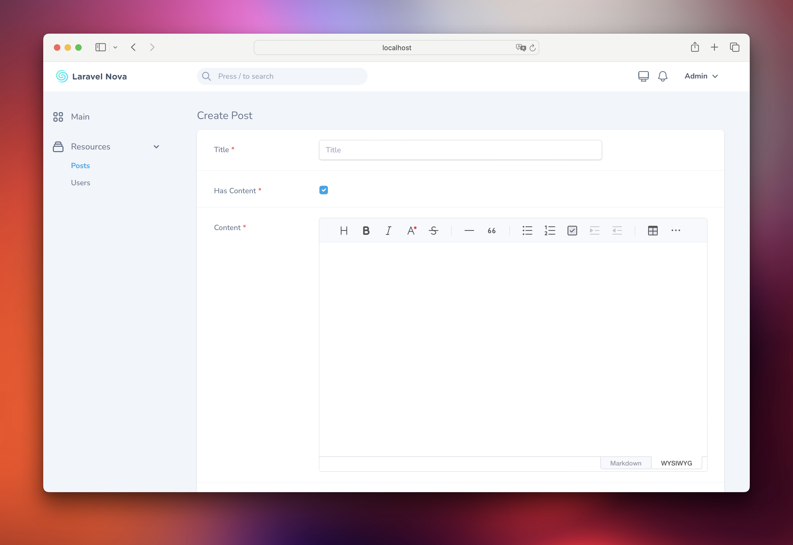

# Laravel Nova Toast UI Editor field

[](https://packagist.org/packages/bbs-lab/nova-toast-ui-editor-field)
[](LICENSE.md)
[](https://styleci.io/repos/285347026)
[](https://scrutinizer-ci.com/g/bbs-lab/nova-toast-ui-editor-field)
[](https://packagist.org/packages/bbs-lab/nova-toast-ui-editor-field)

A [Toast UI Editor](https://ui.toast.com/tui-editor) field for Laravel Nova.



## Contents

- [Installation](#installation)
- [Usage](#usage)
- [Advanced usage](#advanced-usage)
    - [Dependent Fields](#dependent-fields)
    - [Toast UI Editor configuration](#toast-ui-editor-configuration)
    - [Allow iframe in markdown/html](#allow-iframe-in-markdownhtml)
    - [Use Cloudinary as image picker](#use-cloudinary-as-image-picker)
- [Changelog](#changelog)
- [Security](#security)
- [Contributing](#contributing)
- [Credits](#credits)
- [License](#license)

## Installation

You can install the package via composer:

``` bash
composer require bbs-lab/nova-toast-ui-editor-field
```

The package will automatically register itself.

You can publish the config-file with:

```bash
php artisan vendor:publish --provider="BbsLab\NovaToastUiEditorField\FieldServiceProvider" --tag="config"
```

This is the contents of the published config file:

```php
<?php

declare(strict_types=1);

use BbsLab\NovaToastUiEditorField\Enums\ToastUiEditType;
use BbsLab\NovaToastUiEditorField\Enums\ToastUiPreviewStyle;

return [
    'allowIframe' => (bool) env('TOAST_UI_EDITOR_ALLOW_IFRAME', false),

    'height' => env('TOAST_UI_EDITOR_HEIGHT', 'auto'),

    'hideModeSwitch' => (bool)env('TOAST_UI_EDITOR_HIDE_MODE_SWITCH', false),

    'initialEditType' => env('TOAST_UI_EDITOR_INITIAL_EDIT_TYPE', ToastUiEditType::WYSIWYG->value),

    'language' => env('TOAST_UI_EDITOR_LANGUAGE', 'en-US'),

    'minHeight' => env('TOAST_UI_EDITOR_MIN_HEIGHT', '300px'),

    'plugins' => ['chart', 'tableMergedCell', 'uml', 'colorSyntax', 'codeSyntaxHighlight'],

    'previewStyle' => env('TOAST_UI_EDITOR_PREVIEW_STYLE', ToastUiPreviewStyle::TAB->value),

    'toolbarItems' => [
        [
            'heading',
            'bold',
            'italic',
            'strike',
        ],
        [
            'hr',
            'quote',
        ],
        [
            'ul',
            'ol',
            'task',
            'indent',
            'outdent',
        ],
        [
            'table',
            'image',
            'link',
        ],
        [
            'code',
            'codeblock',
        ],
    ],

    'usageStatistics' => (bool)env('TOAST_UI_EDITOR_USAGE_STATISTICS', false),

    'useCloudinary' => (bool) env('TOAST_UI_EDITOR_USE_CLOUDINARY', false),

    'cloudinary' => [
        'cloud_name' => env('CLOUDINARY_CLOUD_NAME', ''),
        'api_key' => env('CLOUDINARY_API_KEY', ''),
        'api_secret' => env('CLOUDINARY_API_SECRET', ''),
        'username' => env('CLOUDINARY_USERNAME', ''),
    ],

    'useCommandShortcut' => (bool)env('TOAST_UI_EDITOR_USE_COMMAND_SHORTCUT', true),
];

```


## Usage

You can use the `BBSLab\NovaToastUiEditorField\ToastUiEditor` field in your Nova resource:

```php
<?php

namespace App\Nova;

use BBSLab\NovaToastUiEditorField\ToastUiEditor;
use Illuminate\Http\Request;

class BlogPost extends Resource
{
    // ...
    
    public function fields(Request $request)
    {
        return [
            // ...

            ToastUiEditor::make('Content'),

            // ...
        ];
    }
    
}
```

> [!IMPORTANT]
> The field will store the markdown content in the database.


## Advanced usage

### Dependent Fields

You may use the `dependsOn` method to conditionally display the field based on the value of another field. See the example below:

```php
<?php

declare(strict_types=1);

namespace Workbench\App\Nova;

use BbsLab\NovaToastUiEditorField\Enums\ToastUiEditType;
use BbsLab\NovaToastUiEditorField\Enums\ToastUiLanguage;
use BbsLab\NovaToastUiEditorField\ToastUiEditor;
use Laravel\Nova\Fields\Boolean;
use Laravel\Nova\Fields\FormData;
use Laravel\Nova\Fields\ID;
use Laravel\Nova\Fields\Text;
use Laravel\Nova\Http\Requests\NovaRequest;

class Post extends Resource
{
    public static $model = \Workbench\App\Models\Post::class;

    public static $title = 'title';

    public static $search = [
        'id', 'title',
    ];

    public function fields(NovaRequest $request): array
    {
        return [
            ID::make()->sortable(),

            Text::make('Title')
                ->sortable()
                ->rules('required', 'max:255'),

            Boolean::make('Has Content')
                ->sortable()
                ->rules('required'),

            ToastUiEditor::make('Content')
                ->rules('nullable')
                ->fullWidth()
                ->hide()
                ->dependsOn('has_content', function (ToastUiEditor $field, NovaRequest $request, FormData $formData) {
                    if ($formData->has_content) {
                        $field
                            ->show()
                            ->rules('required');
                    } else {
                        $field->hide();
                    }
                }),
        ];
    }
}
```

> [!TIP]
> More information about dependent fields can be found in the [official documentation](https://nova.laravel.com/docs/resources/fields.html#dependent-fields).

### Toast UI Editor configuration

You may configure the underlying Toast UI Editor instance with the following field's methods.
Checkout [Toast UI - Vue Editor](https://github.com/nhn/tui.editor/tree/master/apps/vue-editor#props) documentation.

> [!NOTE]
> You may also configure defaults in config-file.

- `height(string $height)`
- `hideModeSwitch(bool $hideModeSwitch = true)`
- `initialEditType(ToastUiEditType $editType)`
- `language(ToastUiLanguage $language)`
- `minHeight(string $minHeight)`
- `plugins(array $plugins)`
- `previewStyle(ToastUiPreviewStyle $previewStyle)`
- `toolbarItems(array $toolbarItems)`
- `usageStatistics(bool $usageStatistics = true)`
- `useCommandShortcut(bool $useCommandShortcut = true)`

### Allow iframe in markdown/html

`allowIframe(bool $allowIframe = true)`

### Use Cloudinary as image picker

`useCloudinary(bool $useCloudinary = true)`

> [!IMPORTANT]
> You must configure your Cloudinary credentials as described in nova-toast-ui-editor-field config file.

## Changelog

Please see [CHANGELOG](CHANGELOG.md) for more information on recent changes.

## Security

If you discover any security related issues, please email paris@big-boss-studio.com instead of using the issue tracker.

## Contributing

Please see [CONTRIBUTING](CONTRIBUTING.md) for details.

## Credits

- [Mikaël Popowicz](https://github.com/mikaelpopowicz)
- [All Contributors](../../contributors)

## License

The MIT License (MIT). Please see [License File](LICENSE.md) for more information.
